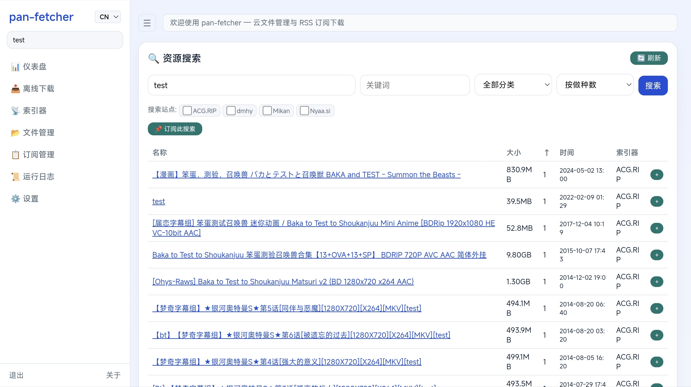
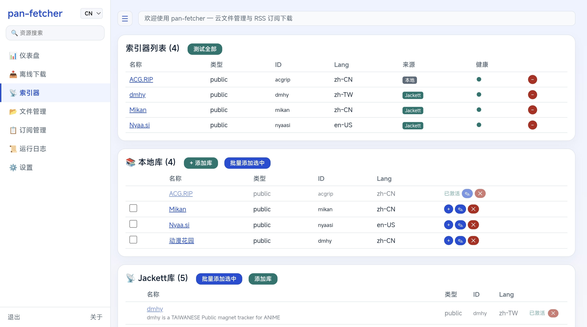
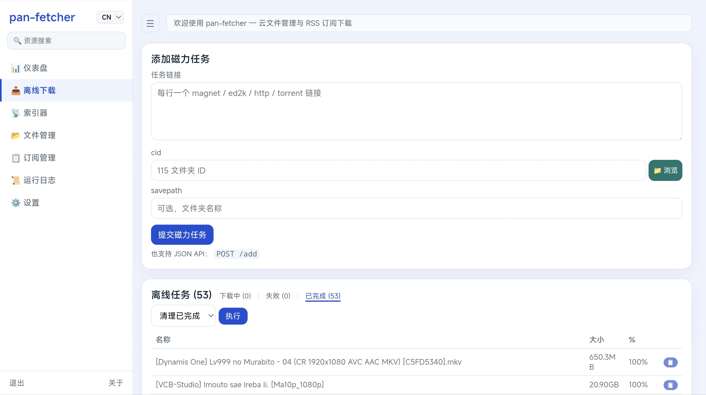
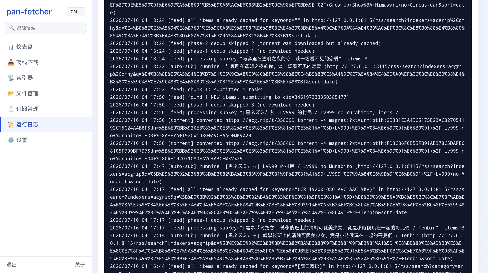

# pan-fetcher · 115 网盘 RSS BT 下载订阅工具

<p align="center">
  <strong>聚合搜索 · Jackett/Prowlarr 集成 · TMDB 发现 · 自动订阅 · 离线下载 · 文件管理</strong>
</p>

<p align="center">
  <a href="https://github.com/mguyenanastacio-glitch/pan-fetcher/releases"></a>
  <a href="https://github.com/mguyenanastacio-glitch/pan-fetcher/blob/master/LICENSE"></a>
  <a href="https://golang.org"></a>
</p>

<p align="center"><strong>中文</strong> | <a href="#english">English</a></p>

---

自动追番 / 追剧工具。搜索资源 → 添加订阅 → 自动推送 115 离线下载，Web 面板管理全流程。支持 Cookies / 扫码登录，所有操作均通过 115 官方 API 进行。

## ✨ 特性

### 🎬 TMDB 发现

搜索电影和剧集，查看完整详情（海报、简介、评分、类型），一键跳转聚合搜索获取资源。

### 🔍 聚合搜索

内置多个 BT 索引器，Cardigann YAML 兼容可自行扩展。标签筛选、关键词过滤、分页浏览。搜索结果自动去重。

<p align="center"></p>

### 📡 Jackett / Prowlarr 集成

自动发现实例中的全部索引器，批量管理、连接测试。搜索结果标注来源，可独立选择参与搜索的索引器。

<p align="center"></p>

### 📋 RSS 订阅

定时抓取、智能去重、关键词过滤、缓存管理。支持本地和 Jackett 索引器的 RSS 聚合。

<p align="center"></p>

### 📥 离线下载

磁力 / ed2k / http 批量提交，状态分栏，任务清理。

<p align="center"></p>

### 📂 文件管理

115 网盘目录浏览、新建、重命名、移动、复制、删除。

<p align="center"></p>

### 📊 仪表盘

运行概览：推送统计、订阅状态、索引器数量、缓存条目、最近新增资源。

<p align="center"></p>

### 🔔 通知推送

企业微信 Webhook 集成，支持多类型推送开关。

<p align="center"></p>

### 📜 运行日志

实时日志输出，自动刷新，便于排查问题。

<p align="center"></p>

### ⚙️ 部署友好

Docker 一键部署、Linux systemd 安装脚本、多平台预编译二进制、Web 界面配置。

<p align="center"></p>


## 🚀 快速开始

### Docker

**Linux / macOS**

```bash
curl -fsSL https://raw.githubusercontent.com/mguyenanastacio-glitch/pan-fetcher/master/scripts/docker-setup.sh | bash
```

**Windows PowerShell**

```powershell
iwr -useb https://raw.githubusercontent.com/mguyenanastacio-glitch/pan-fetcher/master/scripts/docker-setup.ps1 | iex
```

浏览器打开 `http://localhost:8115`，进入设置页完成配置。也提供 [GHCR 镜像](https://github.com/mguyenanastacio-glitch/pan-fetcher/pkgs/container/pan-fetcher)。

### 预编译二进制

从 [Releases](https://github.com/mguyenanastacio-glitch/pan-fetcher/releases) 下载对应平台文件，解压即可运行。

| Linux amd64 | Linux arm64 | macOS amd64 | macOS arm64 | Windows amd64 |
|:--:|:--:|:--:|:--:|:--:|
| `tar.gz` | `tar.gz` | `tar.gz` | `tar.gz` | `zip` |

### Linux 一键脚本

```bash
curl -fsSL https://raw.githubusercontent.com/mguyenanastacio-glitch/pan-fetcher/master/scripts/install-release.sh | sudo bash
```

自动安装为 systemd 服务，支持 `install` / `update` / `uninstall` / `purge`。

### 从源码编译

```bash
git clone https://github.com/mguyenanastacio-glitch/pan-fetcher.git
cd pan-fetcher && go build -ldflags="-s -w" -o pan-fetcher .
./pan-fetcher server
```

## 🖥️ 页面导航

| 页面 | 路由 | 说明 |
|------|------|------|
| 仪表盘 | `/` | 运行概览、最近新增资源 |
| TMDB 发现 | `/discover` | 影视搜索、详情查看、一键搜资源 |
| 离线下载 | `/tasks` | 批量提交、任务管理 |
| 聚合搜索 | `/search` | 多索引器搜索、标签筛选 |
| 索引器 | `/indexers` | 激活管理、连接测试 |
| 文件管理 | `/fs` | 115 网盘浏览与操作 |
| 订阅管理 | `/subs` | RSS 增删改、缓存管理 |
| 运行日志 | `/log` | 实时日志 |
| 设置 | `/settings` | 登录、代理、通知、Jackett、版本更新 |
| 关于 | `/about` | 版本与致谢 |

## ⌨️ CLI 命令

```bash
pan-fetcher server                     # 启动 Web 面板
pan-fetcher magnet --link "magnet:..." # 添加离线任务
pan-fetcher fs ls [dir]                # 浏览网盘目录
pan-fetcher fs shell                   # 交互式 Shell
```

## 🔧 配置参考

```toml
# config.toml
[server]
port = 8115
# domain = "pan.example.com"           # 域名访问
# cert_file = "/certs/fullchain.pem"   # HTTPS 证书
# key_file = "/certs/privkey.pem"

[notify]
wework_webhook = "https://qyapi.weixin.qq.com/cgi-bin/webhook/send?key=xxx"

[proxy]
http = "http://127.0.0.1:7890"         # HTTP 代理（访问 Jackett 等）
```

> 大部分配置可在 Web 设置页直接修改，无需手动编辑文件。

## 🛠️ 技术栈

Go 1.25 · SQLite · 单体 `html/template`（零前端依赖） · [elevengo](https://github.com/Nahuimi/elevengo) 115 API · Cardigann YAML 索引引擎 · Torznab API

## 🙏 致谢

- [zhifengle/rss2cloud](https://github.com/zhifengle/rss2cloud) — 项目原型
- [Prowlarr](https://github.com/Prowlarr/Prowlarr) / [Jackett](https://github.com/Jackett/Jackett) — 索引引擎与 Torznab API 参考
- [Nahuimi/elevengo](https://github.com/Nahuimi/elevengo) — 115 API 库

---

## English

<p align="center"><a href="#">中文</a> | <strong>English</strong></p>

Automated media downloader for 115 cloud storage. Search across BT indexers, discover movies & TV shows via TMDB, subscribe to RSS feeds, auto-push to offline tasks — all managed via a clean Web UI.

### Features

- **🎬 TMDB Discover** — Search movies & TV shows, view full details (poster, overview, rating, genres), one-click jump to aggregated search.
- **🔍 Aggregated Search** — Built-in indexers + Jackett/Prowlarr for hundreds more. Tag filter, keyword filter, pagination, auto-dedup.
- **📡 Jackett/Prowlarr** — Auto-discover, batch activate, connection test, source labels.
- **📋 RSS Subscriptions** — Scheduled fetch, smart dedup, keyword filter, cache management.
- **📥 Offline Download** — Magnet/ed2k/http batch submit with status tabs.
- **📂 File Manager** — Browse and manage 115 cloud files (mkdir, rename, move, copy, delete).
- **📊 Dashboard** — Stats overview, recent subscription items.
- **🔔 Notifications** — WeChat Work webhook with per-event toggles.
- **📜 Runtime Log** — Real-time log output with auto-refresh.
- **🐳 Docker** — One-command deploy via `docker-compose`, also on GHCR.
- **⚙️ Web Admin** — CN/EN bilingual, HTTPS, password auth, in-app update.

### Quick Start

**Docker:**

Linux / macOS:
```bash
curl -fsSL https://raw.githubusercontent.com/mguyenanastacio-glitch/pan-fetcher/master/scripts/docker-setup.sh | bash
```

Windows PowerShell:
```powershell
iwr -useb https://raw.githubusercontent.com/mguyenanastacio-glitch/pan-fetcher/master/scripts/docker-setup.ps1 | iex
```

Also available on [GHCR](https://github.com/mguyenanastacio-glitch/pan-fetcher/pkgs/container/pan-fetcher).

**Prebuilt binaries:** [GitHub Releases](https://github.com/mguyenanastacio-glitch/pan-fetcher/releases)

| Linux amd64 | Linux arm64 | macOS amd64 | macOS arm64 | Windows amd64 |
|:--:|:--:|:--:|:--:|:--:|
| `tar.gz` | `tar.gz` | `tar.gz` | `tar.gz` | `zip` |

**Linux one-liner:** `curl -fsSL https://.../install-release.sh | sudo bash`

**From source:** `go build -ldflags="-s -w" -o pan-fetcher . && ./pan-fetcher server`

### Pages

| Page | Route | Description |
|------|-------|-------------|
| Dashboard | `/` | Stats overview, recent items |
| TMDB Discover | `/discover` | Movie & TV search, detail view, one-click resource search |
| Offline Download | `/tasks` | Batch submit, task management |
| Aggregated Search | `/search` | Multi-indexer search, tag filter |
| Indexers | `/indexers` | Activate, deactivate, connection test |
| File Manager | `/fs` | 115 cloud storage browse & operations |
| Subscriptions | `/subs` | RSS CRUD, cache management |
| Runtime Log | `/log` | Real-time log |
| Settings | `/settings` | Login, proxy, notify, Jackett, updates |
| About | `/about` | Version & credits |

### CLI

```bash
pan-fetcher server                     # Start web panel
pan-fetcher magnet --link "magnet:..." # Add offline task
pan-fetcher fs ls [dir]                # List cloud directory
pan-fetcher fs shell                   # Interactive shell
```

### Configuration

```toml
# config.toml
[server]
port = 8115

[notify]
wework_webhook = "https://qyapi.weixin.qq.com/cgi-bin/webhook/send?key=xxx"

[proxy]
http = "http://127.0.0.1:7890"
```

> Most settings can be changed via the Web admin panel.

### Tech Stack

Go 1.25 · SQLite · single `html/template` (zero frontend deps) · [elevengo](https://github.com/Nahuimi/elevengo) · Cardigann YAML · Torznab API

### Credits

Based on [zhifengle/rss2cloud](https://github.com/zhifengle/rss2cloud). Indexer engine inspired by [Prowlarr](https://github.com/Prowlarr/Prowlarr) & [Jackett](https://github.com/Jackett/Jackett).

### License

[MIT](LICENSE)